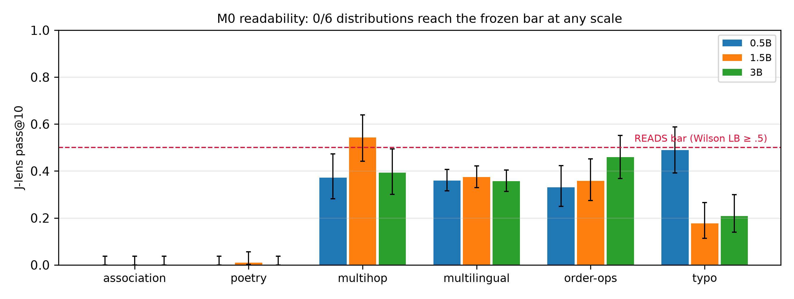
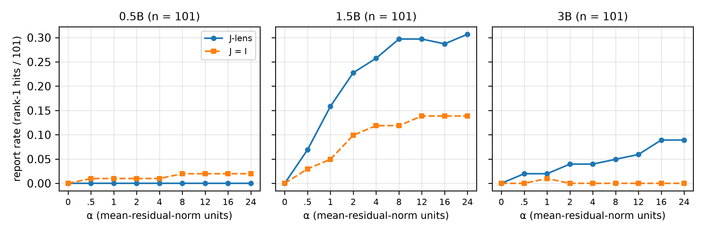
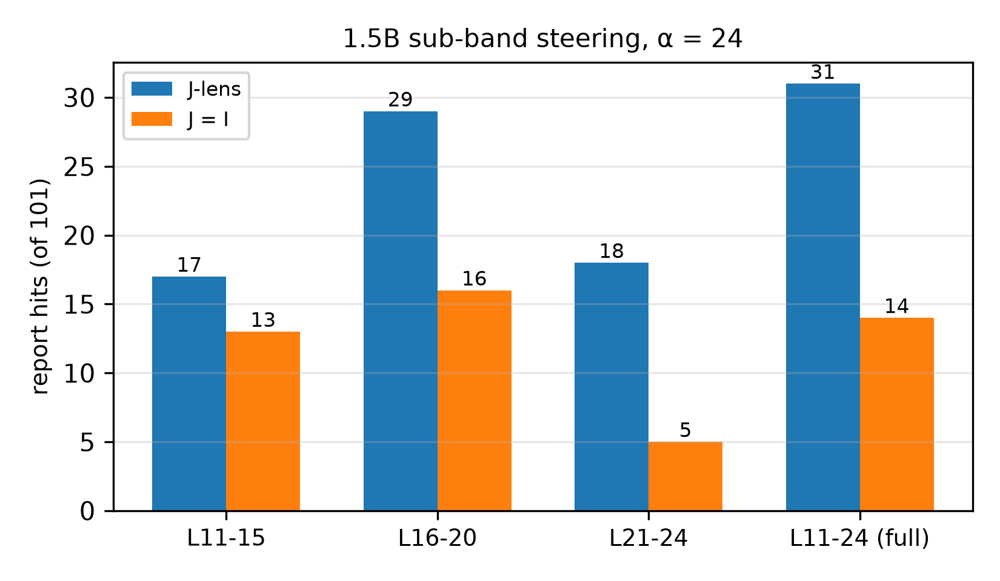
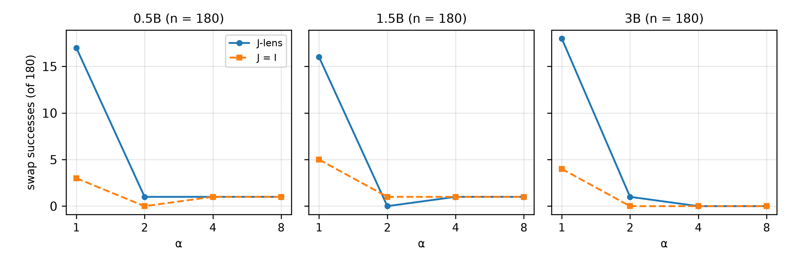
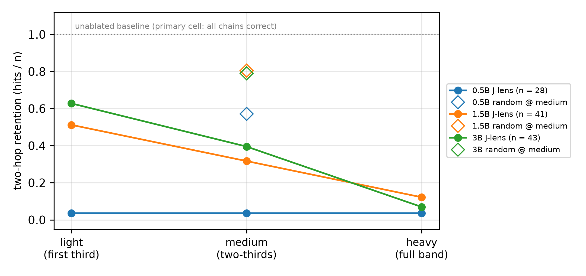
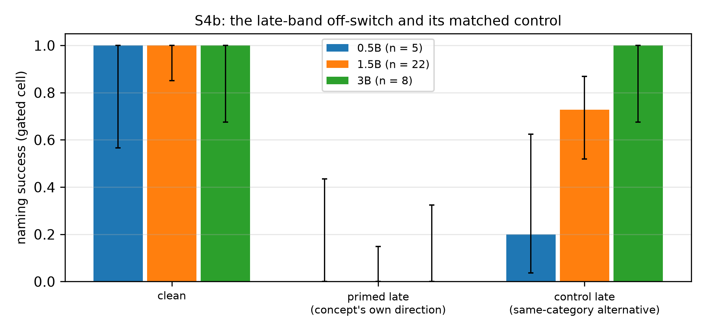

> **Plain-English rewrite (ELI5 edition).**
> - **Paper:** *Is the Global Workspace Readable in Small Language Models? A Pre-Registered Three-Scale Null, and the Structure Inside It*
> - **Authors:** none listed in the paper itself; it is the write-up of the dim-stage project (`github.com/ksdisch/dim-stage`)
> - **Source:** `docs/paper/dim-stage-paper.md` in this repository
> - **Generated:** 2026-07-19
> - **What this is:** a plain-English rewrite that mirrors the original 1:1 — same headings, same paragraphs in the same order; nothing summarized, merged, dropped, or reordered. Tables, the equation, the code block, and the References section are kept verbatim, each followed by an italic *"In plain words"* note; the six figure images are kept (paths adjusted to point at `docs/paper/figures/`), with their captions rewritten. Only the language has changed.

---

# Is the Global Workspace Readable in Small Language Models? A Pre-Registered Three-Scale Null, and the Structure Inside It

*dim-stage — a hobby-budget project that re-built and measured a published method. Every
number in this paper is copied exactly from result files already saved in the project's
repository (`results/*.json`) and from its stage records (`docs/*-BRIEF.md`,
`docs/DECISIONS.md`, `docs/ROADMAP.md`); nothing was re-run or re-calculated just for
this write-up. The six figures are drawn by a script (`docs/paper/figures.py`, run with
`uv run --with matplotlib docs/paper/figures.py`) that reads those same saved result
files and produces identical output every time; every plotted value is a count or a
rate that was already recorded in those files.*

## Abstract

Anthropic's paper "Verbalizable Representations Form a Global Workspace in Language
Models" (2026) introduces a tool called the Jacobian lens. A language model carries, at
each word position, a running vector of numbers that every layer reads from and adds to
(the residual stream); the Jacobian lens is a per-layer conversion matrix (a linear
map) that translates a middle layer's residual-stream vector into the coordinate system
(basis) the final layer uses, and then decodes the result with the model's own final
word-scoring step (the unembedding). The Anthropic paper reports that what this lens
reads out behaves like a global workspace — a shared mental scratchpad whose contents
the model can report out loud, that can be swapped for other content, and that can be
steered from outside. The method is demonstrated on models of 27 billion parameters and
above; the paper names readability below that size an open question. We answer it for
Qwen2.5-0.5B, 1.5B, and 3B-Instruct. We re-built the lens independently from the
paper's written description, validated it against Anthropic's reference implementation
(our conversion matrices matched the reference's bit for bit at every layer, and the
two implementations' readouts agreed on 3220 of 3220 held-out checks), and measured
readability plus seven workspace properties under statistical pass/fail rules committed
before any run (Wilson 95% confidence intervals — standard error bars for a percentage
computed from counts — on each measured cell; Newcombe 95% intervals — the matching
error bars for a difference between two percentages — on comparisons; and at least 20
trials per cell, or the cell is declared UNDERPOWERED in advance). The headline is a
null result — the tested effect did not show up — whose pass/fail bar was registered
before the data existed: 0 of 6 evaluation distributions reach the frozen readability
bar at any of the three sizes. The downstream properties, measured descriptively under
a re-scope that was also registered in advance, land far below the paper's own
reported numbers (verbal report .105–.175 versus the paper's .88; two-hop flips
.073–.286 versus .60) — but with real structure inside: a clean dose–response for
injected thoughts at 1.5B (0 reports rising to 30 of 101 as the injection strength
climbs) that is CI-cleanly specific to the lens's conversion step — "CI-clean" meaning
the whole 95% error bar sits on one side of zero, so the effect is not plausibly
nothing — and that localizes to the middle of the workspace band; a CI-clean advantage
for the Jacobian conversion when writing into two-hop reasoning at 3B; and
selectivity — flexible reasoning dies when the workspace directions are surgically
removed, while random damage and ordinary next-word prediction survive — which is the
only property to clear its full pre-committed gate on all three subjects.

## 1. Introduction

Anthropic's workspace paper makes a concrete, testable set of claims: a band of middle
layers in the residual stream — the model's running internal vector, one per word
position — read through a Jacobian lens, holds content the model can verbally report
in its answers, content that carries multi-step reasoning from one step to the next,
and content the model can turn up or down when instructed to. The paper demonstrates
these claims on Claude-family models and on a 27-billion-parameter open model, and it
explicitly leaves open whether any of this is readable in models below that size.

This project's contribution is deliberately narrow and honestly framed: **we
reproduced and measured a published method — here is the narrow, measured slice.**
Nothing here is invented. We built the procedure that fits the lens — that estimates
its conversion matrices — independently, working only from the paper's written
specification; proved it computes the same mathematical object as the reference
implementation; fitted lenses to three small instruction-tuned Qwen models (variants
trained to follow chat-style instructions) on consumer hardware (one fit required
$0.83 of rented GPU time); and ran the paper's own shipped experiments under pass/fail
gates whose wording — down to the exact verdict sentences — was frozen as code before
any real run.

The result is a null with structure. At the bar registered in advance, the workspace
is not readable at 0.5B, 1.5B, or 3B: the risk declared up front as able to kill the
project's central question (the kill-risk) fired, and it held under an escalation to
the third scale whose trigger was itself registered in advance. Everything downstream
of readability was therefore re-scoped — a change also registered in advance — from
claims of reproducing the paper to *descriptive characterization*: the identical
protocols and statistics, with verdicts worded as "what swaps/steering/ablation do at
scales where the workspace is not readable." Within that frame, small models are not a
scaled-down copy of the paper's subjects but a different regime with recognizable
traces of the same phenomena: one subject (1.5B) reports injected thoughts along a
clean dose–response curve — the report rate climbing smoothly as the injection
strength rises; the Jacobian conversion step (the transport) is sometimes the entire
effect and sometimes worse than doing nothing; and the band the paper calls the
workspace is causally load-bearing for flexible reasoning at every scale we can
reach — damage it and reasoning breaks — even though its contents are not readable at
the frozen bar.

A null whose pass/fail rule was committed before the data is a reportable result, not
a failure to hide. This paper reports it, the escalation that confirmed it, and the
property measurements around it, with every gate verdict exactly as frozen — including
the ones that came back "not shown."

## 2. Background and method

### 2.1 The Jacobian lens

A transformer language model processes text as a sequence of tokens (word-pieces), and
for each token position it keeps a running vector that every layer reads and adds
to — this is the **residual stream**. At the end, the **unembedding** step turns the
final layer's residual vector into one raw score (a **logit**) per vocabulary token;
the highest-scoring token is what the model says next. The classic **logit lens** is
the trick of applying that final unembedding directly to a *middle* layer's residual
vector, to peek at what the model is "thinking" partway through; the trick quietly
assumes that middle layers write their numbers in the same coordinate system the final
layer uses, which is mostly not true. The **Jacobian lens** repairs this by first
multiplying the middle-layer vector by `J_l`, the *average Jacobian* of the final
layer's residual with respect to layer `l` — a Jacobian is a matrix of sensitivities,
recording how much each number in the final layer's vector would shift if you nudged
each number in layer `l`'s vector, and it is estimated here by backpropagation (the
gradient machinery normally used to train networks) over a fit corpus (a set of
example texts used just for this estimation) — and then unembedding:
`lens_l(h) = unembed(J_l @ h)`.

*In plain words: to read layer `l`'s vector `h`, first push it through the conversion
matrix `J_l` — translating it into the final layer's coordinate system — then run the
model's normal final word-scoring step on the result.*

Following the reference implementation's spec, `J_l` is estimated by injecting one-hot
cotangents — probe signals that are all zeros except a single 1, each asking the
backpropagation machinery about exactly one output number — at every valid target
position at once and backpropagating (one vector–Jacobian product, i.e. one backward
sweep, per output dimension), summing over current-and-future target positions,
averaging over source positions, and keeping a running average over prompts. The paper
locates the lens-readable "workspace" in a contiguous band of middle layers — roughly
38%–92% of the way through the network's depth, with layer numbers re-indexed as
percentages so differently sized models can be compared.

### 2.2 What we measured

Eight properties, each anchored to one of the paper's own experiments — the paper's
published number for that experiment serves as our comparison point (its anchor) —
and, wherever the reference repository ships stimuli (the actual test prompts and
items), run on those stimuli word for word:

- **M0 Readability** — can the lens recover content known to be in the workspace (six
  evaluation distributions — six themed test sets shipped with the reference code) with
  the right answer inside the lens's top 10 ranked guesses (rank ≤ 10)?
- **M1 Verbal report** — swap out the answer the model has ready, performing the swap
  in the lens's coordinate system; does the model's spoken report follow the swap?
  Plus **verbal introspection**: steer a concept into the model's internals and ask
  the model to name what was injected.
- **M2 Two-hop swap** — in a question that needs a hidden middle step, swap that
  unspoken bridge entity mid-reasoning; does the final answer follow the redirected
  chain?
- **M3 Directed modulation** — instructed to think about (or ignore) a concept while
  copying unrelated text, does the concept surface in the lens's readout?
- **S1** — harden M1's dose–response finding on three fronts: a falsification arm (a
  control built to kill the effect if it is not real), a saturation check (does the
  effect level off at high strength), and layer localization (which layers carry it).
- **S2 Flexible generalization (broadcast)** — one identical swap applied across
  sixteen function templates (sixteen task frames that each compute something
  different from the same argument); do many different circuits consume the swapped
  argument?
- **S3 Selectivity** — ablate the workspace (surgically remove it, by projecting out —
  mathematically deleting — the vector component along the top-10 lens directions at
  each layer × position); flexible reasoning should die, automatic prediction survive.
- **S4/S4b Naming vs avoiding** — delete one implied concept's lens direction (the
  direction in vector space the lens associates with that concept) early or late in
  the band, under instructions to name the concept versus to avoid saying it.

### 2.3 Measurement discipline

Every verdict in this project was decided by machinery frozen — written, committed,
and locked — before the first real run of its stage:

- **Deterministic oracles only.** An oracle is whatever decides a trial's outcome;
  deterministic means it returns the same answer every time, with no judgment calls.
  Every outcome is a logit ranking read straight from tensors (the model's arrays of
  numbers) — whether a token is the #1 readout anywhere over the workspace band, the
  identity of the model's greedy next token (its single most likely continuation), or
  the rank achieved by a swapped-in candidate. No large-language-model judges, no
  parsing of output text.
- **Wilson 95% confidence intervals on cells; Newcombe 95% intervals on
  differences.** A cell is one measured condition (one model × one setting); Wilson
  intervals are the standard error bars for a percentage built from counts, and
  Newcombe intervals are the matching error bars for a *difference* between two
  percentages. This is like-for-like with the paper, which reports Wilson intervals
  natively. A difference whose interval includes zero is stated as a null or small
  effect, never a win.
- **At least 20 trials per cell (N ≥ 20), or the verdict is pre-declared
  UNDERPOWERED** — too few trials for the error bars to support a firm conclusion.
- **Gates as code, dry-run first.** Each pass/fail gate is an actual program; each
  runner script validates its inputs and exits `VERDICT: INVALID` when fed the wrong
  experimental arm, and that wrong-arm rehearsal (the dry-run) was executed before
  every official run. Verdict wording — including "does not modulate" and
  "NOT shown" — was frozen in advance.
- **A standing falsification arm.** Nearly every experiment repeats the identical
  operation with `J = I` — the conversion matrix replaced by the identity matrix, the
  do-nothing matrix that leaves every vector unchanged, so the lens degenerates to the
  raw unembedding rows, i.e. the plain logit lens with no conversion — with a Newcombe
  interval on the difference between arms. Any claim about the *Jacobian* has to beat
  doing nothing.
- **Deviations are owned.** Every departure from the paper's exact procedure is a row
  in a per-stage deviations table; the headline rows appear in §6.
- **Runtime self-checks.** The intervention operators — the code that performs swaps,
  steering, and ablations — re-verify their own defining algebra on every real
  application, by reading coordinates back and confirming the operation did exactly
  what it claims (coordinate read-back); this check stayed silent across every
  recorded run, and it caught two genuine numerical failures during the S3 build
  before any result was recorded.

### 2.4 Correctness gates

The lens fitter — our independently written code that estimates the `J_l` matrices —
was validated by an **AGREE gate** against the reference implementation, on an
identical model and a byte-identical prompt list: the maximum per-layer relative
Frobenius distance (a single number summarizing how different two matrices are) was
**0.000e+00** — bitwise-identical `J_l` at every layer, against an allowed tolerance
of 1e-3 — and top-1 readout agreement was **3220/3220** held-out cells (Wilson lower
bound .9988, above the required .95). The reference package is pinned as a
dev-dependency — installed for development checks only — and used by the cross-check
alone; no measurement code imports it.

The reference ships no intervention or ablation code, so the swap, steering, and
projection-removal operators are gated instead by **pre-committed invariants** —
mathematical properties, fixed in advance, that the code must provably satisfy: a
rigged analytic subject (a tiny hand-built model whose Jacobian is known exactly on
paper) on which every post-patch logit is asserted with exact equality; exact null-op
checks (steering at strength α = 0 and swaps where source equals target must change
nothing); agreement with the paper's literal pseudoinverse formula — the pseudoinverse
being the standard best-possible inverse for matrices that have no true inverse — on
random tensors; and the runtime coordinate read-back above.

## 3. Experimental setup

**Subjects.** Qwen2.5-0.5B-Instruct, Qwen2.5-1.5B-Instruct, and — as the escalation —
Qwen2.5-3B-Instruct (0.5B = half a billion learned parameters, and so on). The
Instruct variants were chosen because the shipped stimuli are in chat format, which
those variants are trained to follow. The project's kickoff registered the escalation
trigger in advance: fit 3B only if *both* smaller subjects came back null on
readability. They did, and it was.

**Bands.** The paper's workspace band spans 38–92% of network depth; we transplanted
it onto each subject proportionally — same percentage range, converted to each model's
own layer numbers — and registered the result per subject in advance: layers 9–21 on
0.5B, layers 11–24 on 1.5B, layers 14–32 on 3B. The 3B band was frozen and merged into
the repository before its fit had produced a single readout.

**Lens fits.** The fit corpus is the first 100 records of WikiText-103 (a standard
public dataset of Wikipedia articles) that are at least 600 characters long, streamed
in order via the reference's own loader convention — which makes the corpus
deterministic and byte-identical across implementations (an owned deviation from the
paper's ~1000 generic web-text sequences; the paper's own §9.3 reports lens quality
saturating from far fewer prompts). Fits ran in fp32 — standard 32-bit floating-point
precision — on Apple-silicon MPS, Apple's framework for running compute on Mac GPUs
(0.5B: 71 minutes; 1.5B: about 6.1 hours, against a rate of 42.7 seconds per prompt
measured in its first hour). The 3B model's fp32 backward pass — the backpropagation
sweep — needed more working memory than the machine's 24 GB of unified memory (Mac RAM
shared between CPU and GPU), hitting a measured slowdown cliff of about 25× at every
batching setting tried, so the 3B fit ran on a rented RTX 4090 instead (CUDA — NVIDIA's
GPU framework — in fp32, about 57 minutes at 34.5 seconds per prompt, total spend about
$0.83) with a byte-identical procedure and prompt list; the returned lens file was
checksum-verified (its digital fingerprint confirmed intact) and all grading then ran
locally, exactly like the other two subjects. An incidental measured fact: raising the
fitter's `dim_batch` setting (how many output dimensions each backward sweep handles)
from 8 to 32 changes no math but is ~25× *slower* on MPS (44.1 and 42.7 seconds versus
1192.0 and 931.0 seconds on the first two prompts).

**Stimuli.** The paper's own experiment data, exactly as shipped in the reference
repository (`verbal-report.json`, `verbal-introspection.json`, `probe-swap.json`,
`directed-modulation.json`, `flexible-generalization.json`, the two selectivity item
sets, and the six `lens-eval-*` distributions). One mechanical pre-filter: because
grading works by token rank, a stimulus is dropped if its graded word has no
single-token form in Qwen's tokenizer (the model's fixed vocabulary of word-pieces).
Every drop is counted: 94–100% of graded intermediates survive per M0 distribution;
9 of 90 two-hop items and 12 of 192 generalization trials are dropped.

**Constructed components are labeled as constructed.** The S4 item set is the
project's first constructed stimulus set (the reference ships none for that
experiment): 20 concepts × 3 clues, drawn only from vocabularies already measured in
earlier stages, frozen in the repository before any run, with the paper's own
competence-gate pattern (a pre-check that the model can do the basic task at all)
doing the filtering. Three smaller owned constructions: M3's copy-instruction prompt
frame and its no-instruction baseline condition (the paper specifies neither), and the
steering/swap strength grids (the paper sweeps strength but publishes no grid). Each
is pre-declared in its stage brief.

**Modes.** After M0's triple null, every downstream verdict is **descriptive** — the
re-scope registered in advance. Gate wording was still frozen per stage before its
runs, so "what the gate would have said" is reported without any after-the-fact
choice; we write those as *would-gate* verdicts below.

## 4. Results

Throughout, error bars are Wilson 95% intervals (on cells) or Newcombe 95% intervals
(on differences). "J − I" is the J-lens arm's rate minus the identity arm's rate (the
`J = I` control: raw unembedding rows, i.e. the plain logit lens). Counts and
intervals are quoted from the committed per-run JSON files and stage records; the note
under each table names its source file.

### 4.1 M0 — Readability: NULL at all three scales

The frozen gate: a subject READS if and only if the J-lens's pass@10 rate — how often
the correct word lands inside the lens's top 10 guesses — has a Wilson lower bound of
at least 0.5 (the pessimistic edge of the error bar sits at or above 50%) on at least
3 of the 6 distributions. **Verdict: NULL on 0.5B, 1.5B, and 3B — 0/6 distributions
pass on every subject.** The pre-declared kill-risk fired, and held under the
pre-registered 3B escalation: no point in the reachable range exists where readability
emerges.

| Distribution | 0.5B J-lens pass@10 | 1.5B | 3B | Closest arm-2 story |
|---|---|---|---|---|
| association | 0/99 | 0/99 | 0/99 | no gap at any scale |
| poetry | 0/98 | 1/98 | 0/98 | no gap at any scale |
| multihop | 35/94 (37.2%) | 51/94 (54.3%) | 37/94 (39.4%) | no gap |
| multilingual | 149/414 (36.0%) | 155/414 (37.4%) | 148/414 (35.7%) | J-advantage at 0.5B only (+.208 [+.149, +.265]) |
| order-ops | 36/109 (33.0%) | 39/109 (35.8%) | 50/109 (45.9%) | J-advantage at 3B (+.165 [+.037, +.286]) |
| typo | 47/96 (49.0%) | 17/96 (17.7%) | 20/96 (20.8%) | 0.5B +.427 [+.309, +.531]; 1.5B **−.271 [−.389, −.141]**; 3B **−.323 [−.442, −.188]** |

*In plain words: each row is one themed test set and each cell counts how often the
lens's top 10 contained the right answer. The two abstract-content rows are zeros
almost everywhere; the more surface-level rows hover between a third and a half —
never enough to clear the bar. The last column tells how the no-conversion control arm
compared: on typo, the control actually beats the J-lens at 1.5B and 3B (the bolded
negative differences).*

*Source: `results/readability-qwen2.5-{0.5b,1.5b,3b}-instruct.json`; tables in
`docs/M0-BRIEF.md`.*



*Figure 1 — The headline null: the J-lens's top-10 hit rate per evaluation
distribution with its recorded Wilson 95% error bars (each cell holds 94–414 items),
for all three subjects. The dashed line marks the frozen READS criterion — which
applies to the **lower** end of the error bar: 1.5B multihop's point estimate (54.3%)
pokes above the line, but its lower bound (.442) does not, so it still fails. Plotted
values and intervals are read verbatim from
`results/readability-qwen2.5-{0.5b,1.5b,3b}-instruct.json`.*

There is structure inside the null. The two distributions testing abstract content
(association — a concept evoked but never named; poetry — a rhyme word planned but not
yet said) are hard zeros at all three scales — precisely the most workspace-like
content. Content closer to the text's surface is partially readable but below the bar
and not steadily improving with size (non-monotone in scale): multihop peaks at 1.5B
(54.3%) then falls back at 3B (39.4%), and the closest any cell comes to the bar is
order-ops at 3B (45.9%, Wilson lower bound .368, short of .5). The conversion step's
value is content-dependent, not a scale trend: on typo it *reverses* CI-cleanly at
1.5B and 3B — the whole error bar on the difference is below zero, so the plain logit
lens genuinely reads this surface-form content better — while order-ops regains a
CI-clean J-advantage at 3B.

### 4.2 M1 — Verbal report: the report does not follow the swap

Protocol: take the answer the model is about to give (its greedy answer) and swap it,
in lens coordinates and across the band, for a candidate word that was nowhere near
the top beforehand (rank 11 or worse at baseline); success = the swapped-in candidate
reaches the top 5 at the position where the model reads out its answer. Paper anchor:
.88 (Claude Sonnet 4.5).

| Subject | n eligible | J-lens top-5 | J = I top-5 | J − I (Newcombe 95%) |
|---|---|---|---|---|
| 0.5B | 97 | 17/97 = .175 [.112, .263] | 13/97 = .134 | +.041 [−.062, +.144] |
| 1.5B | 89 | 11/89 = .124 [.070, .208] | 8/89 = .090 | +.034 [−.060, +.129] |
| 3B | 86 | 9/86 = .105 [.056, .187] | 10/86 = .116 | −.012 [−.109, +.086] |

*In plain words: each row is one subject, "n eligible" is how many test items
qualified, and the swap succeeds on roughly 10–18% of them — against the paper's 88%.
The last column is the J-lens's edge over the no-conversion control: every one of
those error bars straddles zero, so there is no real edge.*

*Source: `results/verbal-report-qwen2.5-*.json`.*

Every Wilson upper bound — the optimistic edge of every error bar — sits below .27, a
fifth of the anchor. No J − I interval excludes zero, and when graded at rank-1 (the
swapped word must become the single top answer) the raw unembedding rows beat the
J-lens vectors on every subject (7/5/9 vs 3/4/6 hits). Writing into the workspace does
not reach the spoken report at these scales, with or without the conversion step.

### 4.3 M1 — Verbal introspection: a dose–response at 1.5B only

Protocol: steer a concept's direction into the band — add the vector the lens
associates with that concept into the residual stream — over the question turn of a
chat asking "do you detect an injected thought?"; the report rate counts a hit when
the concept is the #1-ranked token at the opening quote of a teacher-forced reply (we
feed the model a fixed reply template and read its internal preferences along the way,
rather than letting it write freely). α = 0 — injecting nothing — is the control. (The
paper cites a best-strength report rate of 0.54 for Claude; it publishes no strength
grid — ours is an owned convention.)

| α (mean-residual-norm units) | 0.5B | 1.5B | 3B |
|---|---|---|---|
| 0 (control) | 0/101 | 0/101 | 0/101 |
| 0.5 | 0/101 | 7/101 | 2/101 |
| 1 | 0/101 | 16/101 | 2/101 |
| 2 | 0/101 | 23/101 | 4/101 |
| 4 | 0/101 | 26/101 | 4/101 |
| 8 | 0/101 | **30/101 = .297 [.217, .392]** | 5/101 = .050 [.021, .111] |

*In plain words: each row is one injection strength (α, measured in units of the
typical length of the model's internal vectors), and each cell counts how many of 101
concepts the model named. 0.5B never reports anything; 3B barely does; 1.5B climbs
smoothly from 0 to 30 of 101 as the dose rises — and with nothing injected (the
control row), no subject ever names the concept on its own.*

*Source: `results/introspection-qwen2.5-*.json`; the median steered ranks quoted
below are recomputed from the per-concept ranks in `results/derived-contrasts.json`
(original record: `docs/DECISIONS.md` / `docs/M1-BRIEF.md`).*

The control is exactly 0/101 on every subject — with nothing injected, no steered word
is ever the model's unprompted answer — so the 1.5B curve cannot be the prompt begging
concept words out of the model. The 1.5B–3B gap at α = 8 is CI-clean (error bars
[.217, .392] vs [.021, .111], not overlapping) — the strongest descriptive contrast in
the project, and further evidence that the phenomenon does not grow steadily with
scale. Steering moves the concept's rank on every subject (median steered rank,
control → α = 8: 3747 → 1322 at 0.5B, 4430 → 15 at 1.5B, 3791 → 382 at 3B); only 1.5B
converts that movement into actual reports.

### 4.4 M2 — Two-hop swap: mostly fails; where it works, only through the transport

Protocol: on the paper's 90 shipped two-hop prompts (9 dropped by the single-token
filter), swap the unspoken bridge entity — the hidden middle step of the reasoning,
e.g. replacing Brazil with Mexico — across the band; success = the model's greedy
answer becomes the redirected chain's answer (graded at top-1, the same grading the
anchor uses). The primary cell counts only items the subject answered correctly
unswapped. Anchor: .60 on these 90 prompts (Sonnet 4.5); 54–70% across Claude tiers.

| Subject | Baseline | J-lens flips | J = I flips | J − I (Newcombe 95%) | Answer-swap J / I |
|---|---|---|---|---|---|
| 0.5B | 28/81 = .346 | 8/28 = .286 [.153, .471] | 4/28 | +.143 [−.075, +.347] | 16/28 / 14/28 |
| 1.5B | 41/81 = .506 | 3/41 = .073 [.025, .194] | 0/41 | +.073 [−.025, +.194] | 9/41 / 7/41 |
| 3B | 43/81 = .531 | 5/43 = .116 [.051, .245] | 0/43 | **+.116 [+.011, +.245]** | 6/43 / 3/43 |

*In plain words: "Baseline" is how many of the 81 usable chains each model could
answer correctly untouched — only 35–53% even before any intervention. "Flips" count
how often the swap redirected the final answer. The standout is 3B: the control arm
flips nothing (0/43) while the J-lens flips 5, and that difference's error bar stays
above zero. The last column is a comparison arm where the final answer itself is
swapped instead of the middle step.*

*Source: `results/two-hop-qwen2.5-*.json`.*

Flip rates sit at .073–.286 against the .60 anchor (and the 0.5B "high" rides on only
28 working chains). The 3B cell is the project's first CI-clean Jacobian-conversion
advantage for *writing*: raw unembedding rows flip 0/43 while J-lens vectors flip
5/43, and the difference's interval excludes zero. The answer-swap comparison arm —
the paper's check for the "smuggling" confound, i.e. whether apparent bridge-swaps are
really just sneaking the final answer in directly; run at a single band — is 2× the
intermediate rate at 0.5B but equal by 3B (6 vs 5), and combined with the raw-row
zeros there is no answer-smuggling signature at 3B. Mostly, though, the swap disturbs
chains rather than redirecting them: the model's original answer is knocked away on
14/28, 12/41, and 18/43 of primary trials.

### 4.5 M3 — Directed modulation: gate says no; the structure inside is the paper's

Protocol (reading only — nothing is written into the model): give an instruction
("think about X" = focus; merely mention X = control; "ignore X" = suppress; or no
instruction at all) and then teacher-force the model to copy an unrelated carrier
sentence — the neutral text it copies while we watch its internals; a hit = a tracked
token is the lens's #1 readout at any (layer, position) over the carrier span. The
frozen would-gate: the subject "modulates" only if the focus − suppress difference
excludes zero on *both* shipped stimulus families and the pooled no-instruction
baseline is clean (Wilson upper bound ≤ .10). **Verdict: "does not modulate" on all
three subjects** — the math family is a hard zero everywhere (focus 0/120 at every
scale, both arms) and the gate needs both families.

| Subject (category family, J-lens) | focus | control | suppress | baseline (pooled) | focus − suppress | focus − control |
|---|---|---|---|---|---|---|
| 0.5B | 2/110 | 0/132 | 1/286 | 0/46 (UB .077) | +.015 [−.006, +.060] | +.018 [−.013, +.064] |
| 1.5B | 6/110 | 0/132 | 0/286 | 0/46 | **+.055 [+.022, +.114]** | **+.055 [+.014, +.114]** |
| 3B | 9/110 | 0/132 | 0/286 | 0/46 | **+.082 [+.041, +.148]** | **+.082 [+.034, +.148]** |

*In plain words: on the category family, "think about X" produces a few lens hits (2,
then 6, then 9 of 110 as the models grow) while merely mentioning X, being told to
ignore X, or hearing nothing at all produce essentially none — exactly the ordering
the paper describes. At 1.5B and 3B, the focus-vs-suppress and focus-vs-control
differences have error bars entirely above zero.*

*Source: `results/directed-modulation-qwen2.5-*.json`; the cross-scale focus
contrast quoted below is recomputed in `results/derived-contrasts.json` (original
record: `docs/DECISIONS.md`, M3 outcomes).*

The anchor the paper cites does reproduce: the no-instruction baseline is essentially
zero on every subject, in both arms (pooled 0/46, upper bound .077, under the
pre-declared .10). On concrete category content the signal is real, ordered exactly as
the paper describes (focus far above control ≈ suppress ≈ baseline ≈ 0), CI-clean at
1.5B and 3B, and its growth across scale is CI-clean too (J-lens focus, 3B − 0.5B:
+.064 [+.004, +.131]). Two divergences from the paper. First, mention does not prime
at these scales — merely naming the concept does not push it into the workspace
(control 0–4 hits of 132 everywhere, versus the paper's finding of mention ≈ focus).
Second, no white-bear effect is measurable — the ironic-rebound effect where trying
not to think of something makes it appear. Nothing enters the workspace uninstructed
in the first place (suppress ≈ baseline ≈ 0), so suppression has nothing to visibly
fail at: a non-test rather than a null. And at 3B the phenomenon is read better
*without* the conversion step: the plain logit lens reads the focused concept 19/110
versus the J-lens's 9/110 (J − logit −.091 [−.181, −.002], CI-clean, and the
logit-lens signal is itself clean on its own contrasts: control 4/132, suppress
0/286).

### 4.6 S1 — The 1.5B dose–response, hardened on three fronts

S1 added the one control arm M1's flagship finding never had (the J = I falsification
arm on the introspection curve), extended the strength grid (appending α ∈ {12, 16,
24}; an owned convention), and steered each sub-band third separately. No subject's
output collapsed at any α — the degeneracy guard, an automatic check for output that
has degenerated into repetitive junk, never fired.

| α | 1.5B J-lens | 1.5B J = I | J − I (Newcombe 95%) |
|---|---|---|---|
| 1 | 16/101 | 5/101 | +.109 [+.024, +.197] |
| 2 | 23/101 | 10/101 | +.129 [+.026, +.230] |
| 4 | 26/101 | 12/101 | +.139 [+.031, +.244] |
| 8 | 30/101 | 12/101 | **+.178 [+.067, +.286]** |
| 12 | 30/101 | 14/101 | +.158 [+.045, +.268] |
| 16 | 29/101 | 14/101 | +.149 [+.035, +.258] |
| 24 | 31/101 | 14/101 | +.168 [+.054, +.278] |

*In plain words: at every strength from α = 1 upward, the J-lens arm reports the
injected concept roughly twice as often as the no-conversion control arm, and every
difference's error bar sits fully above zero.*



*Figure 2 — The introspection dose–response: how often the injected concept becomes
the #1-ranked report (hits / 101) versus steering strength α, over the full 9-point
grid {0, 0.5, 1, 2, 4, 8, 12, 16, 24}, J-lens and J = I arms side by side, 101
concepts per cell. Plotted values are the recorded `report_hits`/n counts with no
smoothing; the α tick marks are evenly spaced for legibility rather than to scale.
Source: `results/s1-introspection-qwen2.5-{0.5b,1.5b,3b}-instruct.json`.*

| Sub-band (1.5B, α = 24) | J-lens | J = I | J − I |
|---|---|---|---|
| L11–15 (early) | 17/101 | 13/101 | +.040 [−.060, +.139] |
| **L16–20 (middle)** | **29/101** | 16/101 | **+.129 [+.014, +.240]** |
| L21–24 (late) | 18/101 | 5/101 | **+.129 [+.041, +.219]** |
| full band L11–24 | 31/101 | 14/101 | +.168 [+.054, +.278] |

*In plain words: steering only the middle third of the band (layers 16–20) recovers
29 of the full band's 31 reports; the early third adds little beyond the control.*

*Source: `results/s1-introspection-qwen2.5-*.json`; sub-band difference intervals as
recorded in `docs/S1-BRIEF.md` / `docs/DECISIONS.md` and recomputed in
`results/derived-contrasts.json`.*



*Figure 3 — S1 localization: report hits (of n = 101) when steering only layers
11–15, only 16–20, only 21–24, or the full band 11–24, at α = 24 on 1.5B, J-lens
versus J = I arms. Plotted values are the recorded `report_hits` counts. Source:
`results/s1-introspection-qwen2.5-1.5b-instruct.json`, `localization` block.*

Three findings. **(1) The curve is a conversion-step effect:** the J-lens beats the
raw-unembedding arm CI-cleanly from α = 1 onward, roughly doubling the report rate at
the plateau (30–31 vs 12–14) — matching the paper's specificity control, and the
project's first CI-clean Jacobian advantage for *report*. **(2) It saturates, in the
shape of the paper's Figure 7:** the rank-1 report rate levels off at ~30/101 from
α = 8 (30/30/29/31 across strengths 8→24) while the median reciprocal rank — take
1/rank per concept and look at the median; higher means the concept sits nearer the
top — keeps tightening (.067 → .125); genuine saturation, not collapse. **(3) It
localizes to the middle of the band:** steering only L16–20 recovers 29/101,
essentially the full band's 31/101 (full − mid +.020 [−.105, +.144], straddling
zero) — the paper's mid-layer "middle block" at hobby scale. A cross-scale bonus from
the extended grid: 3B's small reporting signal (up to 9/101 at α = 16–24) is *purely*
conversion-specific — its identity arm is essentially dead (0–1/101; J − I CI-clean
from α = 8, +.050 [+.003, +.111], up to +.089 [+.034, +.161]) — while 0.5B is null on
both arms.

### 4.7 S2 — Broadcast: a narrow, transport-specific routing signal that overdose destroys

Protocol: the paper's sixteen function templates over four argument categories
(countries, months, animals, numbers); one identical lens-coordinate swap clamped in
place at every prompt position; success = the greedy answer becomes the correct answer
for the swapped-in argument. The item set is verbatim from the paper; 180/192 trials
are gradable under the standing single-token filter (all 12 drops are in animals).
Anchors: 76/192 at α = 1, rescued to 101/192 at α = 2 (Sonnet-scale). **Would-gate:
"does not route" on all three subjects** (the pooled Wilson lower bounds at α = 2 are
≈ 0 against the frozen floor of .5).

| Cell (of 180) | 0.5B | 1.5B | 3B |
|---|---|---|---|
| α=1 J-lens | 17 | 16 | 18 |
| α=2 J-lens | 1 | 0 | 1 |
| α=1 J = I | 3 | 5 | 4 |
| J − I at α=1 | **+.078 [+.031, +.131]** | **+.061 [+.012, +.114]** | **+.078 [+.029, +.132]** |
| conditioned α=1 J-lens | 13/42 | 12/62 | 16/56 |

*In plain words: at α = 1 the J-lens redirects 16–18 of 180 trials — several times the
control arm's 3–5, with all three difference bars above zero — but doubling the
strength to α = 2, which rescued the effect in the paper, instead wipes it out here
(1, 0, and 1 successes). The last row grades only trials where the model provably knew
both facts involved.*

*Source: `results/s2-generalization-qwen2.5-*.json`.*



*Figure 4 — The S2 α-cliff: pooled swap successes (of n = 180 gradable trials) at
strengths α ∈ {1, 2, 4, 8}, J-lens versus J = I arms, per subject. Plotted values are
the recorded pooled `successes` counts. Source:
`results/s2-generalization-qwen2.5-{0.5b,1.5b,3b}-instruct.json`.*

A routing signal exists, and at α = 1 it is CI-cleanly specific to the conversion step
on all three subjects — at about a tenth of the anchor's size. But the paper's dose
direction *inverts* here: at α = 2 the greedy output becomes the swapped-in argument
itself (the model says " France" or " China" instead of computing with it) and the
target answer falls out of the top ranks — at 1.5B all the way to the vocabulary
floor, a median rank of 151,844.5 out of 151,936 over the trials that had succeeded at
α = 1 (recomputed in `results/derived-contrasts.json`). Overdose converts an
argument-to-compute-with into an output-to-say. The degeneracy guard separates this
behavioral blurting (the model still emits real words, so the guard stays silent) from
its one true catch: 3B at α = 8, where both arms collapse into an attractor repeating
`!` at a share of 1.00 of the output. Category structure tracks the paper wherever
signal exists: 1.5B matches the paper's order exactly (countries 10/48 > months 4/48 >
animals 2/36 > numbers 0/48), and the paper's own predictor of routability —
workspace loading, its measure of how strongly a category's content occupies the
workspace — puts numbers lowest at every scale (.095/.075/.044), with the top end
aligning at 3B (countries load highest, .125, and route best). The conditioned frame
(both facts provably known unswapped) shows routing at 3–4× the unconditional rate and
exposes the numbers zero as a knowledge/pragmatics confound rather than a routing
failure: 0/16 numbers diagonal cells on every subject (the models continue "Two times
three equals" with " what", or with bare whitespace at 3B).

### 4.8 S3 — Selectivity: the only would-gate to hold on all three subjects

Protocol: at every band-layer × position, project out the residual stream's component
along the top-10 lens directions — mathematically delete exactly the part of the
vector lying along the ten directions the lens ranks highest there — while never
ablating directions for tokens in the clean model's top-10 next-token predictions (so
the model's ordinary immediate output is deliberately spared). Tiers grow the layer
range (light = first third of the band, medium = two-thirds, heavy = full band), and a
control at the medium tier removes a matched *count* of randomly chosen directions
instead. Flexible task: M2's two-hop items (the unablated baselines reproduce M2 bit
for bit: 28/81, 41/81, 43/81). Automatic task: plain next-word prediction on fresh
WikiText records, provably disjoint from the fit corpus; the metric is per-position
top-1 match with the clean model (~11,058 positions per cell). **Would-gate:
selectivity-consistent on all three subjects** — all three frozen legs hold
everywhere.

| Leg (Newcombe 95%) | 0.5B | 1.5B | 3B |
|---|---|---|---|
| (i) clean − heavy two-hop | +.964 [+.778, +.994] | +.878 [+.719, +.947] | +.930 [+.788, +.976] |
| (ii) wikitext match − two-hop retention @ heavy | +.187 [+.045, +.218] | +.244 [+.111, +.314] | +.358 [+.241, +.404] |
| (iii) random − J-lens retention @ medium | +.536 [+.306, +.702] | +.488 [+.277, +.641] | +.395 [+.189, +.558] |

*In plain words: leg (i) says full-band ablation almost always destroys a
previously-correct two-hop chain; leg (ii) says ordinary word prediction survives the
same surgery far better than two-hop reasoning does; leg (iii) says removing random
directions instead of the lens's own leaves reasoning largely standing — the damage is
specific to the lens's directions. All nine error bars sit above zero.*

| Two-hop retention (primary cell) | 0.5B (n=28) | 1.5B (n=41) | 3B (n=43) |
|---|---|---|---|
| J-lens light / medium / heavy | 1 / 1 / 1 | 21 / 13 / 5 | 27 / 17 / 3 |
| random @ medium | 16 | 33 | 34 |

*In plain words: of the chains each model could do cleanly, how many survive each
ablation tier — 0.5B falls off a cliff even at light; 1.5B degrades gradually
(21 → 13 → 5 of 41); 3B likewise (27 → 17 → 3 of 43); random damage leaves most
chains standing (16, 33, 34).*

| WikiText top-1 match | 0.5B | 1.5B | 3B |
|---|---|---|---|
| J-lens light / medium / heavy | .405 / .315 / .223 | .612 / .491 / .366 | .699 / .595 / .428 |
| random @ medium | .743 | .827 | .816 |

*In plain words: the fraction of ordinary next-word predictions still matching the
clean model — it degrades with tier but stays far above two-hop survival, and random
damage barely dents it (.74–.83).*

*Source: `results/s3-selectivity-qwen2.5-*.json`.*



*Figure 5 — S3 selectivity: the fraction of two-hop chains retained (hits / n) versus
ablation tier, per subject, over the primary cell (chains answered correctly
unablated; n = 28 / 41 / 43 — so the unablated baseline is 1.0 by construction, the
dotted line). Open diamonds: the matched random-direction control at the medium tier
(16/28, 33/41, 34/43). Plotted values are the recorded `hits`/n counts. Source:
`results/s3-selectivity-qwen2.5-{0.5b,1.5b,3b}-instruct.json`, `two_hop.primary`.*

The paper's dissociation between flexible and automatic processing is present and
CI-clean at every scale: targeted removal kills two-hop chains while matched random
damage and ordinary prediction survive CI-cleanly above them. 0.5B is a cliff (even
light ablation kills the chain); 1.5B shows the paper's graded dose curve
(21 → 13 → 5); 3B is sharper still (27 → 17 → 3). The qualifier we own: this is
**relative** selectivity — heavy ablation still changes 78%/63%/57% of ordinary
predictions (nowhere near the paper's "mostly intact"); the claim is that the flexible
task is hit CI-cleanly harder, never surgical precision. The two shipped targeted item
sets add texture that was declared UNDERPOWERED in advance: a passage's language
enters the lens when the task demands it (under explicit language questions, 7/8, 8/8,
and 8/8 passages show it, versus 0/8, 2/8, 1/8 under an automatic task; pooled
contrasts +.071 [+.027, +.118] / +.097 [+.037, +.153] / +.139 [+.079, +.198]), and
line-count information is most present under the direct how-many-lines question while
trailing under automatic linewrap at every scale.

### 4.9 S4/S4b — Naming vs avoiding: NOT shown; the off-switch is concept-specific

Protocol (on a constructed item set — the project's first, frozen before any run; 60
items, all gradable): a clue implies a concept; instructions either name it or avoid
saying it; then a k = 1 ablation — removing exactly one direction, the concept's own
lens direction — is applied at the early, middle, or late third of the band, plus a
control that removes a different same-category concept's direction instead. The
competence gate (our greedy-decoding form of the paper's P ≥ .85 / P ≤ .15 criterion):
before any ablation, naming must succeed AND avoidance must not blurt the forbidden
word. **Would-gate: NOT shown on all three subjects.**

The competence gate is itself the first finding: gated cells are 5 / **22** / 8 of 60
(0.5B / 1.5B / 3B; UNDERPOWERED at 0.5B and 3B) — clean naming succeeds on only
20/28/21 of 60 items, and clean avoidance blurts the forbidden concept on 17/6/13.
Only 1.5B reliably does the exclusion task — the same subject where the introspection
phenomenon lives. On the gated cells, ablating the primed concept's direction early in
the band raises avoidance failure nowhere (leg 1: 0.5B +.400 [−.118, +.769]; 1.5B
+.000 [−.149, +.149]; 3B +.000 [−.324, +.324] — every bar straddles zero); the leg
pre-declared as a null check (naming should be unharmed by early ablation) holds
everywhere; and the requirement that the primed direction beat the control direction
fails everywhere. The early-band suppression copy the paper describes — a copy of the
concept, held early in the band, that implements avoiding it — does not appear at
these scales.

The late half of the paper's dissociation reproduces as a hard switch, and the S4b
follow-up (a full re-run; every cell shared with the original run reproduced bit for
bit) added the matched late-tier control the original design lacked:

| Naming success (gated cell) | 0.5B (n=5, UNDERPOWERED) | 1.5B (n=22) | 3B (n=8, UNDERPOWERED) |
|---|---|---|---|
| primed_late | 0 | 0 | 0 |
| control_late | 1 | 16 | 8 |
| D31 gate (control − primed) | +.200 [−.264, +.624] — not shown | **+.727 [+.471, +.868] — concept-specific** | +1.000 [+.541, +1.000] — concept-specific (UNDERPOWERED) |
| concept mass, control vs primed | .204 vs .000 | .658 vs .003 | .924 vs .000 |

*In plain words: on items that passed the competence gate, ablating the concept's own
late-band direction drops naming to zero everywhere ("primed_late"), while ablating a
different concept's direction ("control_late") leaves naming mostly intact at 1.5B and
fully intact at 3B. The "D31 gate" row is the control-minus-primed difference with its
error bar; the last row is how much probability the model still puts on the concept
word.*

*Source: `results/s4-avoidance-qwen2.5-*.json` (S4b cells superseded in place).*

Removing one direction at the late band third erases the model's ability to say that
word (naming 0/n, concept probability mass ≈ .000, on every subject). On the one
subject with enough trials to decide (1.5B), the switch is concept-specific and
CI-clean; and the specificity emerges with scale — at 0.5B removing *any* single
late-tier direction wrecks output (the control survives 1/5, mass .204 vs a clean-run
.661), while at 3B the control is untouched (8/8, mass .924 ≈ the clean-run .886).
Middle-tier removals are benign for both vectors everywhere.



*Figure 6 — The late-band off-switch and its matched control: naming success on the
competence-gated cell, with the recorded Wilson 95% error bars (n = 5/22/8; the 0.5B
and 3B cells carry their pre-declared UNDERPOWERED tags). Ablating the concept's own
late direction silences naming on every subject (primed late, 0/n); the same-category
control is what separates a genuinely per-concept switch (1.5B, 3B) from
indiscriminate any-direction output damage (0.5B). Plotted values and intervals are
read verbatim from `results/s4-avoidance-qwen2.5-{0.5b,1.5b,3b}-instruct.json`,
`naming_success_gated`.*

### 4.10 Three findings that cut across stages

1. **The Jacobian conversion step earns its keep only sometimes.** For writing into
   the model, it is the entire effect wherever writing works at all (M2's 3B +.116;
   S1's doubling; S2's α = 1 routing; 3B introspection with a dead identity arm). For
   reading out of the model, its value depends on the content: a CI-clean advantage on
   order-ops at 3B (+.165) and multilingual at 0.5B (+.208), but a CI-clean *reversal*
   on typo that deepens with scale (+.427 → −.271 → −.323) and on instructed category
   content at 3B (−.091).
2. **1.5B, not 3B, is where the strongest phenomena live.** The injected-thought
   dose–response (0 → 30/101, control exactly 0), the paper-exact S2 category order,
   the S3 graded ablation curve, and the S4 competence gate (22 vs 5 and 8) all peak
   at the middle subject; multihop readability does too (54.3% at 1.5B vs 39.4% at
   3B). Below 27B, scale is not a knob that turns in one direction.
3. **Where the paper's anchors apply, everything lands well below them** — roughly a
   factor of ten on verbal report and broadcast, a factor of 2–8 on two-hop flips —
   while the *shape* of the phenomena (dose ordering, focus far above suppress with
   baseline ≈ 0, rise-then-saturate, mid-band localization, category ordering) tracks
   the paper wherever any signal exists at all.

## 5. Discussion

The thesis question — is the workspace readable at laptop scale? — has a clean
answer: not at the bar registered in advance, at any of three scales, and the most
workspace-like content (abstract, not yet put into words) is the hardest zero. The
escalation discipline matters here: because the third scale was tried under a
pre-agreed trigger, the triple null closes the question for the reachable range
rather than leaving an "if only we'd tried one more scale" loose end.

What makes the null worth reporting is that the band it concerns is demonstrably not
inert. The same lenses that cannot *read* the workspace at the bar still locate
directions whose removal selectively kills flexible reasoning (S3, the one full-gate
pass), whose injection produces dose-ordered, saturating, mid-band-localized verbal
reports at 1.5B (M1/S1), and whose late-band copies act as concept-specific output
switches (S4b). The honest synthesis is not "small models have no workspace" but
"small models show causal traces of the paper's workspace machinery at a tenth the
strength of its anchors, while the readable, reportable surface the paper builds on
is absent at the frozen bar."

The standing falsification arm turned out to be the project's most productive
instrument. It killed claims (M0's typo distribution; M3's 3B reversal), certified
claims (M2's 3B cell; S1's doubling; S2's α = 1 routing), and showed that "the
Jacobian conversion helps" is not one fact but a family of facts that vary by content
and by direction of use. A small-scale reproduction running only the J-lens arm —
with no control — would have gotten several of these stories wrong, in both
directions.

Finally, the re-scope discipline — deciding in advance that a readability null would
convert all downstream milestones to descriptive characterization — is what lets this
paper report a dose–response and a full gate pass without quietly upgrading either
into a claim of having reproduced the paper. The would-gate verdicts stand as frozen:
does not modulate, does not route, NOT shown. The structure inside them is reported
beside, never instead of, those sentences.

## 6. Threats to validity and limitations

- **The band could be misplaced at small scale.** Transplanting the paper's 38–92%
  depth range proportionally was registered in advance to eliminate forking paths —
  the statistical hazard of trying analyses until one works — at the owned cost that a
  workspace living somewhere else in a small model would read as a false null. This is
  the central alternative to "no readable workspace" that we could not eliminate.
- **Fit corpus.** N = 100 WikiText prompts versus the paper's ~1000 generic web-text
  sequences (the paper's own evidence that quality saturates early motivated the cut;
  still an owned deviation). A richer corpus could conceivably lift readability.
- **Grading conventions the release does not ship are ours.** The mapping from a
  graded intermediate word to a token (accepting the single-token forms of the word
  with and without a leading space, {word, ␣word}, plus the order-ops synonym table),
  the M3 prompt frame, and the strength grids were all constructed here — declared
  before results existed, but not the paper's own artifacts.
- **The falsification arm is `J = I`, not the paper's decomposition.** The paper's
  control contrasts the *components* of a vector lying inside versus outside the
  lens's space; our standing arm substitutes the raw unembedding rows instead.
  Like-for-like within the project, an owned deviation from the paper's exact control.
- **Single-token filter.** Rank-based grading drops stimuli whose key word only exists
  as multiple tokens (9/90 two-hop items, 12/192 generalization trials, 0–6% of M0
  intermediates); every drop is counted, but the measured sets are slightly smaller
  than shipped.
- **UNDERPOWERED cells stay that way.** The S4/S4b gated cells at 0.5B (n = 5) and 3B
  (n = 8), all S3 targeted-arm cells (8 and 11 passages), and S2 per-template cells
  (n = 12) carry pre-declared tags and support no gated claims.
- **Descriptive mode is not a loophole.** All downstream "findings" are
  characterizations of how interventions behave at scales where readability is null;
  none is a claim of reproducing the paper's workspace.
- **Hardware/numerics.** fp32 on MPS for everything except the 3B fit (rented CUDA;
  the floating-point noise from switching devices, on a matrix averaged over a whole
  corpus, is orders of magnitude below any gate's sensitivity, and the fit log's
  per-prompt signature matched).
- **Selectivity is relative.** Heavy ablation changes 57–78% of ordinary predictions;
  the gate compares disruption, it does not certify surgical precision.

## 7. Reproducibility

Everything runs locally and is deterministic — the same inputs give the same outputs
every time. The repository ships the independently written fitter (`fitter.py`), the
AGREE gate, all milestone runners with `--dry-run` validation (wrong-arm inputs exit
`VERDICT: INVALID`), the pre-committed invariant tests, and the per-trial results
JSONs this paper quotes. The fitted lens files are excluded from the repository
(gitignored) — refit to reproduce (0.5B ≈ 71 min on M-series MPS; 1.5B ≈ 6 h; 3B needs
a CUDA GPU, `remote-fit-3b.sh`, ~$0.83 rented in our run — the project's only outside
spend). Stimuli come from cloning the reference repository into `refs/`; models pull
from HuggingFace on first use; no API keys.

```bash
git clone https://github.com/ksdisch/dim-stage && cd dim-stage
git clone https://github.com/anthropics/jacobian-lens refs/jacobian-lens
uv run pytest                          # analytic gate tests; no models needed
uv run fitter.py --model-id Qwen/Qwen2.5-0.5B-Instruct \
  --out lenses/qwen2.5-0.5b-instruct-n100.pt
uv run m0_readability_gate.py --model-id Qwen/Qwen2.5-0.5B-Instruct \
  --lens lenses/qwen2.5-0.5b-instruct-n100.pt --dry-run   # then without --dry-run
```

*In plain words: clone the project and the reference data side by side, run the test
suite (no models needed), fit the smallest model's lens, then rehearse the readability
gate with `--dry-run` before running it for real.*

## References

1. Anthropic. *Verbalizable Representations Form a Global Workspace in Language
   Models.* Transformer Circuits, 2026-07-06.
   https://transformer-circuits.pub/2026/workspace/index.html — no arXiv ID exists;
   the canonical URL is the citation.
2. Anthropic. *jacobian-lens* (reference implementation and shipped experiment
   data). https://github.com/anthropics/jacobian-lens, Apache-2.0, marked "not
   maintained". Pinned as a dev-dependency for the cross-check only.
3. Subjects: Qwen2.5-0.5B/1.5B/3B-Instruct (Hugging Face model IDs
   `Qwen/Qwen2.5-{0.5B,1.5B,3B}-Instruct`); fit corpus: WikiText-103 via the
   reference repository's loader convention. Wilson score intervals and Newcombe
   difference intervals are standard methods and are used here as the lineage's
   stats ruler (`stats.py`); no further sources are recorded in this repository.
